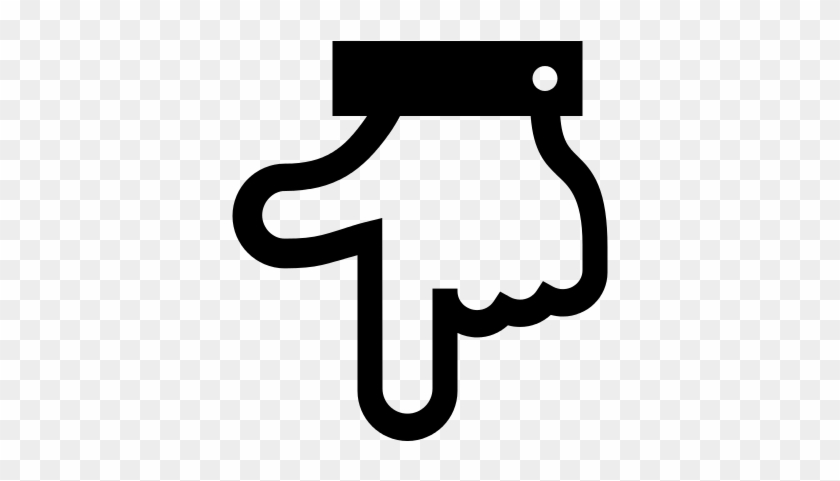

# Awesome CARLA 💙 
A curated list of awesome CARLA tutorials, blogs, and related projects.

## 👉 Table of Contents <a name="TOC" />👈

<!-- MarkdownTOC depth=4 -->
* [Whats The CARLA](#whatsCarla)
* [Releases](#releases)
* [Official Repositories](#official)
* [Tutorials](#tutorials)
* [SampleCodes/Projects](#sample)
    * [Reinforcement Learning](#RL)
    * [Imitation Learning](#IL)
    * [Multi-Agent](#MA)
    * [Detection](#Det)
    * [Segmentatiom](#Seg)
    * [Data Collection/Generating](#collection)
    * [Control](#control)
    * [Other](#Other_Code)
* [Contribution](#contributions)
* [License](#License)
<!-- /MarkdownTOC --> 

## Whats The CARLA ? 👀 <a name="whatsCarla" />

CARLA has been developed from the ground up to support development, training, and validation of autonomous driving systems. In addition to open-source code and protocols, CARLA provides open digital assets (urban layouts, buildings, vehicles) that were created for this purpose and can be used freely. The simulation platform supports flexible specification of sensor suites, environmental conditions, full control of all static and dynamic actors, maps generation and much more.
More info [here](http://carla.org/).

<a name="releases" />

## Releases 📦⛳ 
* [0.9.7 (Linux only) official release](https://github.com/carla-simulator/carla/releases/tag/0.9.7)
* [0.9.7 (windows unofficial release)](https://mega.nz/#!jRIXBQZZ!T5t-g1wYYnmRmTtPHGOLJHAFUngfAphPHqiAn2TvnL8) + [Python API](https://mega.nz/#!zFRwUQJb!2QGp_DhuddpGCa4uMBG07aRZUBVtim597OBZaLZAqBY) found at Discord uploadded by @edufrikuto => NOT tested!
* [0.9.6 (Linux only) official release](https://github.com/carla-simulator/carla/releases/tag/0.9.6)
* [0.9.6 (Windows x64 unofficial release made by me!)](https://drive.google.com/drive/folders/1ptSje3ur6aDaY2qqBYQjiORBLzurxtW1?usp=sharing) - Unzip with 7-Zip or WinRAR => after run CARLA, Unreal installs pre-requirements automatically if needed. also for Python API see this [issue](https://github.com/Amin-Tgz/awesome-CARLA/issues/1#issuecomment-538339385)
* [0.8.4 (Linux & Windows) official release](https://github.com/carla-simulator/carla/releases/tag/0.8.4)

[  **Back to Top**](#TOC) 

<a name="official" />

## Official Repositories 🏢 
* [Main source code](https://github.com/carla-simulator/carla)
* [Traffic scenario definition and execution engine](https://github.com/carla-simulator/scenario_runner) - Work with 0.9.2 and up
* [ROS bridge for CARLA Simulator](https://github.com/carla-simulator/ros-bridge) - Work with 0.9.4 and up
* [Reinforcement learning baseline agent trained with the Actor-critic (A3C) algorithm](https://github.com/carla-simulator/reinforcement-learning) - Work with 0.8.x versions only
* [Repository to store conditional imitation learning based AI that runs on CARLA](https://github.com/carla-simulator/imitation-learning) - Work with 0.8.x versions only
* [Repository to store different driving benchmarks that run on the CARLA simulator](https://github.com/carla-simulator/driving-benchmarks) - Work with 0.8.x versions only
* [Data collector, also contains an client side agent ](https://github.com/carla-simulator/data-collector) - Work with 0.8.x versions only
* [Standalone GUI application to enhance RoadRunner maps with traffic lights and traffic signs information](https://github.com/carla-simulator/carla-map-editor)
* [Integration of AutoWare AV software with the CARLA simulator](https://github.com/carla-simulator/carla-autoware) - Work with 0.9.6

[  **Back to Top**](#TOC)    

## Tutorials <a name="tutorials" /> 📕 📘 📗 📓

* [Introduction to the CARLA simulator: training a neural network to control a car](https://medium.com/asap-report/introduction-to-the-carla-simulator-training-a-neural-network-to-control-a-car-part-1-e1c2c9a056a5)
* [Setting up CARLA Simulator for the Self-Driving Cars Specialization](https://medium.com/datadriveninvestor/setting-up-carla-simulator-for-the-self-driving-cars-specialization-d38d4f6a0486)
* [Official Doc](https://carla.readthedocs.io/en/latest/getting_started/)
* [Coursera(self-driving-cars)](https://www.coursera.org/specializations/self-driving-cars)
* [Model-free Deep Reinforcement Learning for Urban Autonomous Driving](https://www.groundai.com/project/model-free-deep-reinforcement-learning-for-urban-autonomous-driving/)
* [Self-driving cars with Carla and Python(Sentdex Tutorials)](https://pythonprogramming.net/introduction-self-driving-autonomous-cars-carla-python/)

[  **Back to Top**](#TOC) 

## Sample Codes / Projects <a name="sample" /> 🎉🎉🎉   

   ### Reinforcement Learning 🚧 <a name="RL" />
   * [Reinforcement learning rofficial repoistory](https://github.com/carla-simulator/reinforcement-learning) - Work with 0.8.x versions only
   * [Use Reinforcement Learning to train an autonomous driving agent in CARLA Simulator](https://github.com/zhangfuyang/rl_CARLA) - Use version 0.8.2
   * [Autonomous Driving on Carla simulator using Deep Deterministic Policy Gradients](https://github.com/ankur-rc/autodrive_ddpg) - Use version 0.8.2
   * [CIRL: Controllable Imitative Reinforcement Learning for Vision-based Self-driving ](https://github.com/HubFire/Muti-branch-DDPG-CARLA) - version 0.8.2(seems)
   * [customized PPO based agent for Carla](https://github.com/bitsauce/Carla-ppo) - Use version 0.9.5
   * [Setting up Reinforcement Learning Environment for CARLA Autonomous Driving Simulator](https://github.com/GokulNC/Setting-Up-CARLA-Reinforcement-Learning) - Use version 0.8.0
   * [Reinforcement Learning Coach by Intel AI Lab](https://github.com/NervanaSystems/coach) - Use version 0.8.4
   * [What is candy? A model with the structure: Hierarchical Observation(Plan&Policy)Hierarchical Actions](https://github.com/createamind/candy) - Use version 0.8.2 
   * [Reinforcement Learning codebase for self-driving car in Carla](https://github.com/Sentdex/Carla-RL) - Use version 0.9.5
   * [Double DQN to train an agent how to drive autonomously](https://github.com/koustavagoswami/Autonomous-Car-Driving-using-Deep-Reinforcement-Learning-in-Carla-Simulator)  - Use version 0.8.x (seems)
   * [Reinforcement Learning Experiments on Carla](https://github.com/auton-carla/carla-rl)
   * [Hands-On-Intelligent-Agents-with-OpenAI-Gym](https://github.com/PacktPublishing/Hands-On-Intelligent-Agents-with-OpenAI-Gym) - Use version 0.8.x
   * [An OpenAI gym wrapper for CARLA simulator](https://github.com/cjy1992/gym-carla)
   * [Reproducing : https://github.com/intel-isl/DirectFuturePrediction And applying to gym and CARLA](https://github.com/Ourshanabi/DirectFuturePrediction_CARLA)
   
   ### Imitation Learning 🌈 <a name="IL" /> 
   * [imitation-learning official repository](https://github.com/carla-simulator/imitation-learning)
   * [Training framework for conditional imitation learning](https://github.com/felipecode/coiltraine) - Use version 0.8.x
   * [Carla Imitation Learning Trainer](https://github.com/mvpcom/carlaILTrainer) - Use version 0.8.x
   * [A pytorch implementation to train the conditional imitation learning policy](https://github.com/onlytailei/carla_cil_pytorch) - Use version 0.8.x (seems)
   * [Carla-Imitation-Learning ETHZ](https://gitlab.ethz.ch/3D-Driver/Carla-Imitation-Learning/)
   * [Keras implementation of Conditional Imitation Learning](https://github.com/jmarrr/CIL-Keras)
   * [Driving in CARLA using waypoints and two-stage imitation learning](https://github.com/dianchen96/LearningByCheating) - Use version 0.9.6
   * [Module for deep learning powered, stateful imitation learning in the CARLA autonomous vehicle simulator](https://github.com/affinis-lab/core) - Use version 0.8.4
  * [Exploring Distributional Shift in Imitation Learning](https://github.com/franckdess/VITA_CARLA_Tutorial)
  
   ### Multi-Agent <a name="MA" />🌄
   * [Learning Environments for Multi-Agent Connected Autonomous Driving (MACAD)](https://github.com/praveen-palanisamy/macad-gym) - Use version 0.9.x
   * [Build system for the new architecture of CARLA(supports multi-client multi-agent communication)](https://github.com/nsubiron/libcarla)
   
   ### Detection  <a name="Det" /> 🔍
   * [Module for car detection](https://github.com/affinis-lab/car-detection-module) - Use version 0.8.4
   * [Module for detecting traffic lights in the CARLA](https://github.com/affinis-lab/traffic-light-detection-module) - Use version 0.8.4
   * [CARLA-Lane_Detection](https://github.com/angelkim88/CARLA-Lane_Detection) - Use version 0.9.6
   * [Labeled Dataset for Object Detection in Carla Simulator ](https://github.com/DanielHfnr/Carla-Object-Detection-Dataset)
   * [Tensorflow-Carla-Object-Detection](https://github.com/DanielHfnr/Tensorflow-Carla-Object-Detection)
   * [Detect CARLA Simulator's Traffic Speed Sign using YOLO v3](https://github.com/martisaju/CARLA-Speed-Traffic-Sign-Detection-Using-Yolo)
   * [Generating training data from the Carla driving simulator in the KITTI dataset format](https://github.com/enginBozkurt/carla-training-data) - Use version 0.8.x
   * [An application of Tensorflow's object detection API to the Carla simulator](https://github.com/s-nandi/carla-car-detection) - Use version 0.8.4
    
   ### Segmentation <a name="Seg" /> 🌴
   * [Image segmentation using U-Net](https://github.com/henyau/Image-Segmentation-with-Unet)
   * [Semantic segmentation for carla dataset](https://github.com/EvanWY/CARLASemSeg)
   * [Semantic Instance Geometry Network for Unsupervised Perception](https://github.com/raunaks13/carla-SIGNet)
   * [Won 28th place in this competition to accurately detect cars and road](https://github.com/ericlavigne/Lyft-Perception-Challenge)
   
   ### Data Collection/Generating <a name="collection" /> 💾
   * [A CARLA controller for generating datasets and end-to-end models for autonomous vehicle control ](https://github.com/MaxJohnsen/carla-controller)
   * [Carla Simulator Data Collector (semantic segmentation)](https://github.com/enginBozkurt/CarlaSimulatorDataCollector) - Use version 0.8.4
   * [A simple tool for generating training data from the Carla driving simulator](https://github.com/Ozzyz/carla-data-export)
   * [Script for extracting semantic segmentation/depth prediction dataset out of Carla Urban Driving Simulator](https://github.com/alirezahappy/Carla_Script)
   * [Generate visual navigation data for CARLA](https://github.com/IamWangYunKai/carla_py) - 0.9.5
      
   ### Control <a name="control" /> 🔥
   * [Implement Motion Planning for autonomous car on CARLA simulator](https://github.com/paulyehtw/Motion-Planning-on-CARLA)
   * [Longitudinal and lateral car Controller in python for Carla Car Simulator](https://github.com/yoelrc88/carla-sim-controller)
   * [Implementing Lane Keeping Assist (LKA) on CARLA simulator](https://github.com/paulyehtw/Lane-Keeping-Assist-on-CARLA) - Use version 0.8.x
   * [Self Driving Cars Longitudinal and Lateral Control Design](https://github.com/enginBozkurt/SelfDrivingCarsControlDesign) - Use version  0.8.x
   * [Implementing Lane Keeping Assist (LKA) on CARLA simulator](https://github.com/paulyehtw/Lane-Keeping-Assist-on-CARLA)
   * [CARLA_Motion_Planning_for_Self-Driving_Cars_Project](https://github.com/yymmaa0000/CARLA_Motion_Planning_for_Self-Driving_Cars_Project)
   * [Repository for the infinite horizon controller and the preview path tracking controller for Carla-Vehicle assets](https://github.com/aroongta/Carla_Controller)
   
   ### Other <a name="Other_Code" />🚦
   * [Autonomous driving platform running on the CARLA simulator](https://github.com/erdos-project/pylot) <==
   * [MATLAB Carla Interface](https://github.com/darkscyla/MATLAB-Carla-Interface)
   * [Dockerfile to use CARLA ROS bridge on Docker container](https://github.com/atinfinity/carla_ros_bridge_docker)
   * [The OmniScape Dataset](https://github.com/ARSekkat/OmniScape) - Use version 0.9.x
   * [ROS bridge for CARLA simulator](https://github.com/sigmaai/self-driving-golf-cart/blob/master/ros/src/simulation/README.md) - Use version 0.9.2 and up
   * [Small example for loading the CARLA data from the PRECOG paper](https://github.com/nrhine1/precog_carla_dataset) - Use version0.8.x (seems)
   * [A scenario loader for the automotive simulator](https://github.com/MrMushroom/CarlaScenarioLoader) - Use version 0.9.3
   * [My playground with Carla](https://github.com/kvasnyj/carla) - Use version 0.8.x
   * [Simulate precise LiDAR point cloud data from Carla](https://github.com/liuzuxin/Pesudo_Lidar_PointCloud_Carla) - Use version 0.9.6
   * [C++ Client for Unreal Engine 4 running Carla](https://github.com/p-schulz/CarlaClientCpp)
   * [Carla Display on Browser](https://github.com/mellocolate/carla-display) - Use version 0.9.6
   * [Dockerfile to use CARLA ROS bridge on Docker container](https://github.com/atinfinity/carla_ros_bridge_docker) - Use version 0.9.6
   * [A traffic rules monitor for the CARLA simulator](https://github.com/abol-karimi/TrafficMonitor)
   * [Alpha Drive is a platform providing cloud-based tools for testing and validation of AI algorithms in simulation](https://alphadrive.ai/)
   * [Code to generate instance masks for SIGNet, adapted for the CARLA simulator ](https://github.com/raunaks13/Detectron-SIGNet)
   * [Exercises from the Self-Driving Cars Specialization by the University of Toronto on Coursera ](https://github.com/daniel-s-ingram/self_driving_cars_specialization)
   * [Exercises from the Self-Driving Cars Specialization by the University of Toronto on Coursera - 2](https://github.com/qiaoxu123/Self-Driving-Cars)
   * [Platform for Ethical Decision Making in Autonomous Vehicles](https://github.com/zminton/TrolleyMod)
   * [Carla-Simulator environment compatible with Ray/Rllib](https://github.com/layssi/Carla_Ray_Rlib)
   * [VNC/SSH Carla server inside a docker container](https://github.com/volkodava/docker-carla-vnc-desktop)
   * [CARLA Simulatior intergation for the da Vinci Research Kit](https://github.com/ABC-iRobotics/dvrk_carla)
   * [Additional clients examples for Carla](https://github.com/marcgpuig/carla_py_clients)
   
[  **Back to Top**](#TOC) 
 
## Contributions 📭  <a name="contributions" />

Your contributions are always welcome!

If you want to contribute to this list (please do), send me a pull request
Also, if you notice that any of the above listed repositories should be deprecated, due to any of the following reasons:

* Repository's owner explicitly say that "this library is not maintained".
* Not committed for long time (2~3 years).

More info on the [guidelines](https://github.com/Amin-Tgz/awesome-CARLA/blob/master/contributing.md)

## License  <a name="License" />
Licensed under the [Creative Commons CC0 License](https://creativecommons.org/publicdomain/zero/1.0/).

Join Disocrd of Carla:

 

[  **Back to Top**](#TOC) 
