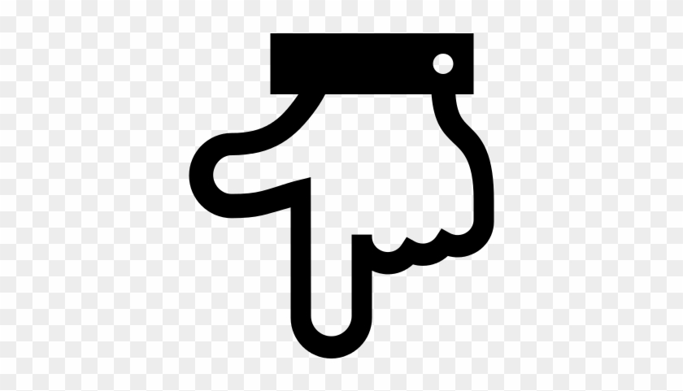
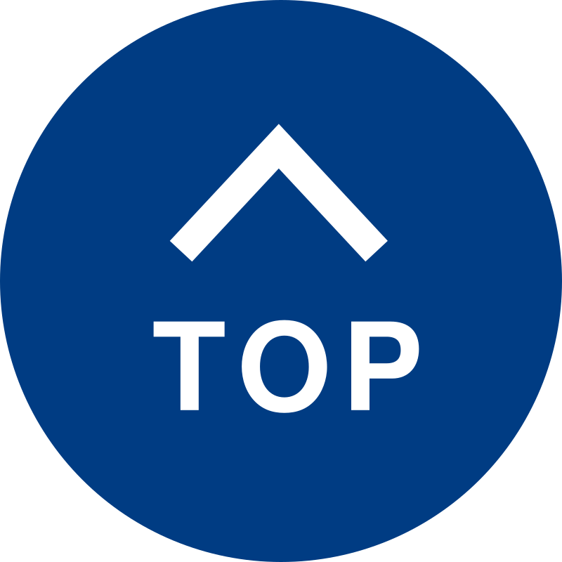

# Awesome CARLA 💙 
A curated list of awesome CARLA tutorials, blogs, and related projects.

## 👉 Table of Contents <a name="TOC" />👈

<!-- MarkdownTOC depth=4 -->
* [Whats The CARLA](#whatsCarla)
* [Releases](#releases)
* [Official Repositories](#official)
* [Tutorials](#tutorials)
* [SampleCodes/Projects](#sample)
    * [Reinforcement Learning](#RL)
    * [Imitation Learning](#IL)
    * [Multi-Agent](#MA)
    * [Detection](#Det)
    * [Segmentation](#Seg)
    * [Data Collection/Generating](#collection)
    * [Control](#control)
    * [End-to-End Driving](#E2E)
    * [Benchmarks / Leaderboard](#benchmark)
    * [Cooperative / V2X](#V2X)
    * [ROS2 / Autoware / Apollo](#ROS2)
    * [Maps / Digital Twin / Sensors / HMI](#Twin)
    * [Other](#Other_Code)
* [Contribution](#contributions)
* [License](#License)
<!-- /MarkdownTOC -->

## Whats The CARLA ? 👀 <a name="whatsCarla" />

CARLA has been developed from the ground up to support development, training, and validation of autonomous driving systems. In addition to open-source code and protocols, CARLA provides open digital assets (urban layouts, buildings, vehicles) that were created for this purpose and can be used freely. The simulation platform supports flexible specification of sensor suites, environmental conditions, full control of all static and dynamic actors, maps generation and much more.
More info [here](http://carla.org/).

<a name="releases" />

## Releases 📦⛳

> Default branch of upstream is now `ue5-dev` (UE5.5). The `ue4-dev` / `0.9.x` line is still maintained (latest `0.9.16`).

* [0.9.16 (UE4, latest 0.9.x, Sep 2025)](https://github.com/carla-simulator/carla/releases/tag/0.9.16) - NVIDIA Cosmos Transfer1 + NuRec neural rendering, SimReady OpenUSD/MDL converter, left-handed traffic, wheelchair VRU model, V2X sensors, Python type hints, devcontainers/Ubuntu 22 Docker
* [0.10.0 (UE5.5, Dec 2024)](https://github.com/carla-simulator/carla/releases/tag/0.10.0) - UE4.26 → UE5.5 migration (Nanite, Lumen, Chaos physics), remodeled Town10 + 13 vehicles, cmake build, native ROS2 server (no bridge needed), Python 3.8-3.12, Scenic 3.0, Mine01 map. Docker: `carlasim/carla:0.10.0`
* [0.9.15](https://github.com/carla-simulator/carla/releases/tag/0.9.15) - Digital Twins v0.1 (OpenStreetMap-based map generation), Town13 + Town15, SymReady assets. Docker: `carlasim/carla:0.9.15`
* [0.9.14](https://github.com/carla-simulator/carla/releases/tag/0.9.14)
* [0.9.13](https://github.com/carla-simulator/carla/releases/tag/0.9.13) - CHRONO vehicle dynamics, SUMO/PTV co-simulation examples
* [0.9.12](https://github.com/carla-simulator/carla/releases/tag/0.9.12) - Large Map feature (tiled maps)
* [0.9.11 (Linux and Windows) official release](https://github.com/carla-simulator/carla/releases/tag/0.9.11)
* [0.9.10 (Linux and Windows) official release](https://github.com/carla-simulator/carla/releases/tag/0.9.10)
* [0.9.9 (Linux and Windows) official release](https://github.com/carla-simulator/carla/releases/tag/0.9.9)
* [0.9.8 (Linux and Windows) official release](https://github.com/carla-simulator/carla/releases/tag/0.9.8)
* [0.9.7 (Linux only) official release](https://github.com/carla-simulator/carla/releases/tag/0.9.7)
* [0.9.7 (windows unofficial release)](https://mega.nz/#!jRIXBQZZ!T5t-g1wYYnmRmTtPHGOLJHAFUngfAphPHqiAn2TvnL8) + [Python API](https://mega.nz/#!zFRwUQJb!2QGp_DhuddpGCa4uMBG07aRZUBVtim597OBZaLZAqBY) found at Discord uploaded by @edufrikuto => NOT tested!
* [0.9.6 (Linux only) official release](https://github.com/carla-simulator/carla/releases/tag/0.9.6)
* [0.9.6 (Windows x64 unofficial release made by me!)](https://drive.google.com/drive/folders/1ptSje3ur6aDaY2qqBYQjiORBLzurxtW1?usp=sharing) - Unzip with 7-Zip or WinRAR => after run CARLA, Unreal installs pre-requirements automatically if needed. also for Python API see this [issue](https://github.com/Amin-Tgz/awesome-CARLA/issues/1#issuecomment-538339385)
* [0.8.4 (Linux & Windows) official release](https://github.com/carla-simulator/carla/releases/tag/0.8.4)

Docs: [UE5 docs (latest)](https://carla-ue5.readthedocs.io/en/latest/) | [UE4 docs](https://carla.readthedocs.io/en/latest/) | [Leaderboard](http://leaderboard.carla.org/)

[  **Back to Top**](#TOC)

<a name="official" />

## Official Repositories 🏢
* [Main source code](https://github.com/carla-simulator/carla) - default branch `ue5-dev` (UE5.5, 0.10.x); legacy `ue4-dev` branch for 0.9.x
* [CARLA Autonomous Driving Leaderboard](https://github.com/carla-simulator/leaderboard) - official evaluation platform, now Leaderboard 2.0/2.1 (use `leaderboard-2.0` branch with matching scenario_runner)
* [Traffic scenario definition and execution engine](https://github.com/carla-simulator/scenario_runner) - v0.9.16 + `leaderboard-2.0` branch, OpenSCENARIO 1.x/2.0 support. Work with 0.9.2 and up
* [ROS bridge for CARLA Simulator](https://github.com/carla-simulator/ros-bridge) - ROS1/ROS2 bridge (`leaderboard-2.0` branch supported). NOTE: CARLA 0.10.0 / 0.9.16 server has native ROS2 support, no bridge needed. Work with 0.9.4 and up
* [Reinforcement learning baseline agent trained with the Actor-critic (A3C) algorithm](https://github.com/carla-simulator/reinforcement-learning) - Work with 0.8.x versions only
* [Repository to store conditional imitation learning based AI that runs on CARLA](https://github.com/carla-simulator/imitation-learning) - Work with 0.8.x versions only
* [Repository to store different driving benchmarks that run on the CARLA simulator](https://github.com/carla-simulator/driving-benchmarks) - Work with 0.8.x versions only
* [Data collector, also contains an client side agent ](https://github.com/carla-simulator/data-collector) - Work with 0.8.x versions only
* [Standalone GUI application to enhance RoadRunner maps with traffic lights and traffic signs information](https://github.com/carla-simulator/carla-map-editor)
* [Integration of AutoWare AV software with the CARLA simulator](https://github.com/carla-simulator/carla-autoware) - Work with 0.9.6

[  **Back to Top**](#TOC)

## Tutorials <a name="tutorials" /> 📕 📘 📗 📓

* [Introduction to the CARLA simulator: training a neural network to control a car](https://medium.com/asap-report/introduction-to-the-carla-simulator-training-a-neural-network-to-control-a-car-part-1-e1c2c9a056a5)
* [Setting up CARLA Simulator for the Self-Driving Cars Specialization](https://medium.com/datadriveninvestor/setting-up-carla-simulator-for-the-self-driving-cars-specialization-d38d4f6a0486)
* [Official Doc](https://carla.readthedocs.io/en/latest/getting_started/)
* [Coursera(self-driving-cars)](https://www.coursera.org/specializations/self-driving-cars)
* [Self-driving cars with Carla and Python(Sentdex Tutorials)](https://pythonprogramming.net/introduction-self-driving-autonomous-cars-carla-python/)
* [CARLA 0.9.16 Python API Basics (Chinese, line-by-line annotated notebook)](https://github.com/Inspired-by-Atmosphere/carla_APIcode) - Single-file Jupyter tutorial covering client connection, map loading, vehicle spawning, autopilot, 4-camera RGB stitch, IMU/GNSS callbacks, LiDAR point-cloud export with Open3D; tested against CARLA 0.9.16
* [My Bibliography for Research on Autonomous Driving](https://github.com/chauvinSimon/My_Bibliography_for_Research_on_Autonomous_Driving)

[  **Back to Top**](#TOC)

## Sample Codes / Projects <a name="sample" /> 🎉🎉🎉

   ### Reinforcement Learning 🚧 <a name="RL" />
   * [Reinforcement learning official repoistory](https://github.com/carla-simulator/reinforcement-learning) - Work with 0.8.x versions only
   * [Use Reinforcement Learning to train an autonomous driving agent in CARLA Simulator](https://github.com/zhangfuyang/rl_CARLA) - Use version 0.8.2
   * [Autonomous Driving on Carla simulator using Deep Deterministic Policy Gradients](https://github.com/ankur-rc/autodrive_ddpg) - Use version 0.8.2
   * [CIRL: Controllable Imitative Reinforcement Learning for Vision-based Self-driving ](https://github.com/HubFire/Muti-branch-DDPG-CARLA) - version 0.8.2(seems)
   * [customized PPO based agent for Carla](https://github.com/bitsauce/Carla-ppo) - Use version 0.9.5
    * [Setting up Reinforcement Learning Environment for CARLA Autonomous Driving Simulator](https://github.com/GokulNC/Setting-Up-CARLA-Reinforcement-Learning) - Use version 0.8.0
   * [What is candy? A model with the structure: Hierarchical Observation(Plan&Policy)Hierarchical Actions](https://github.com/createamind/candy) - Use version 0.8.2
   * [Reinforcement Learning codebase for self-driving car in Carla](https://github.com/Sentdex/Carla-RL) - Use version 0.9.5
    * [Double DQN to train an agent how to drive autonomously](https://github.com/koustavagoswami/Autonomous-Car-Driving-using-Deep-Reinforcement-Learning-in-Carla-Simulator)  - Use version 0.8.x (seems)
   * [Hands-On-Intelligent-Agents-with-OpenAI-Gym](https://github.com/PacktPublishing/Hands-On-Intelligent-Agents-with-OpenAI-Gym) - Use version 0.8.x
   * [An OpenAI gym wrapper for CARLA simulator](https://github.com/cjy1992/gym-carla)
   * [Reproducing : https://github.com/intel-isl/DirectFuturePrediction And applying to gym and CARLA](https://github.com/Ourshanabi/DirectFuturePrediction_CARLA)
   * [CARLA real traffic scenarios](https://github.com/deepsense-ai/carla-real-traffic-scenarios)
    * [DI-drive: Decision Intelligence Auto-driving platform with Carla](https://github.com/opendilab/DI-drive) - ~638★, Decision Intelligence RL+IL platform, actively maintained in 2025
    * [Intersection CARLA Gym: OpenAI Gymnasium Wrapper for Intersection Scenarios in CARLA - Dockerized](https://github.com/faizansana/intersection-carla-gym)
    * [EasyCarla-RL: Simple Autonomous Driving Environment for Reinforcement Learning](https://github.com/silverwingsbot/EasyCarla-RL) - ~265★, easy-to-use RL env on CARLA
    * [CARLA SB3 RL Training Environment: Stable-Baselines3 Training and Evaluation](https://github.com/alberto-mate/CARLA-SB3-RL-Training-Environment) - ~154★, ready-to-use SB3 env
    * [Autonomous Driving in CARLA Using Deep Reinforcement Learning (PPO From Scratch)](https://github.com/idreesshaikh/Autonomous-Driving-in-Carla-using-Deep-Reinforcement-Learning) - ~564★, PPO from scratch
    * [RL CARLA: Train Auto Car in CARLA Simulator With SAC](https://github.com/ShuaibinLi/RL_CARLA) - ~114★, SAC
    * [CARLA GymDrive: Autonomous Driving Episode Generation in a Gym Environment](https://github.com/angelomorgado/CARLA-GymDrive) - ~55★, Gymnasium-based scenario/episode generation
    * [VLM-RL: Unified Vision Language Models and Reinforcement Learning for Safe Driving](https://github.com/zihaosheng/VLM-RL) - ~269★, VLM + RL
    * [CarDreamer: World Model Based Autonomous Driving Platform in CARLA](https://github.com/ucd-dare/CarDreamer) - ~374★, world-model RL/IL platform

   ### Imitation Learning 🌈 <a name="IL" />
   * [imitation-learning official repository](https://github.com/carla-simulator/imitation-learning)
   * [Training framework for conditional imitation learning](https://github.com/felipecode/coiltraine) - Use version 0.8.x
   * [Carla Imitation Learning Trainer](https://github.com/mvpcom/carlaILTrainer) - Use version 0.8.x
   * [A pytorch implementation to train the conditional imitation learning policy](https://github.com/onlytailei/carla_cil_pytorch) - Use version 0.8.x (seems)
   * [Carla-Imitation-Learning ETHZ](https://gitlab.ethz.ch/3D-Driver/Carla-Imitation-Learning/)
   * [Keras implementation of Conditional Imitation Learning](https://github.com/jmarrr/CIL-Keras)
   * [Driving in CARLA using waypoints and two-stage imitation learning](https://github.com/dianchen96/LearningByCheating) - Use version 0.9.6
   * [Module for deep learning powered, stateful imitation learning in the CARLA autonomous vehicle simulator](https://github.com/affinis-lab/core) - Use version 0.8.4
  * [Exploring Distributional Shift in Imitation Learning](https://github.com/franckdess/VITA_CARLA_Tutorial)

   ### Multi-Agent <a name="MA" />🌄
   * [Learning Environments for Multi-Agent Connected Autonomous Driving (MACAD)](https://github.com/praveen-palanisamy/macad-gym) - Use version 0.9.x
   * [Build system for the new architecture of CARLA(supports multi-client multi-agent communication)](https://github.com/nsubiron/libcarla)

   ### Detection  <a name="Det" /> 🔍
   * [Module for car detection](https://github.com/affinis-lab/car-detection-module) - Use version 0.8.4
   * [Module for detecting traffic lights in the CARLA](https://github.com/affinis-lab/traffic-light-detection-module) - Use version 0.8.4
   * [CARLA-Lane_Detection](https://github.com/angelkim88/CARLA-Lane_Detection) - Use version 0.9.6
   * [Labeled Dataset for Object Detection in Carla Simulator ](https://github.com/DanielHfnr/Carla-Object-Detection-Dataset)
   * [Tensorflow-Carla-Object-Detection](https://github.com/DanielHfnr/Tensorflow-Carla-Object-Detection)
   * [Detect CARLA Simulator's Traffic Speed Sign using YOLO v3](https://github.com/martisaju/CARLA-Speed-Traffic-Sign-Detection-Using-Yolo)
   * [Generating training data from the Carla driving simulator in the KITTI dataset format](https://github.com/enginBozkurt/carla-training-data) - Use version 0.8.x
   * [An application of Tensorflow's object detection API to the Carla simulator](https://github.com/s-nandi/carla-car-detection) - Use version 0.8.4
   * [Autonomous car chase: The repository presents a system that can autonomously chase another vehicle](https://github.com/JahodaPaul/autonomous-car-chase)
   
   ### Segmentation <a name="Seg" /> 🌴

   * [DAVID: Densely Annotated Video Driving Data Set](https://mediatum.ub.tum.de/1596437)
   * [Image segmentation using U-Net](https://github.com/henyau/Image-Segmentation-with-Unet)
   * [Semantic segmentation for carla dataset](https://github.com/EvanWY/CARLASemSeg)
   * [Semantic Instance Geometry Network for Unsupervised Perception](https://github.com/raunaks13/carla-SIGNet)
   * [Won 28th place in this competition to accurately detect cars and road](https://github.com/ericlavigne/Lyft-Perception-Challenge)

   ### Data Collection/Generating <a name="collection" /> 💾
   * [A CARLA controller for generating datasets and end-to-end models for autonomous vehicle control ](https://github.com/MaxJohnsen/carla-controller)
   * [Carla Simulator Data Collector (semantic segmentation)](https://github.com/enginBozkurt/CarlaSimulatorDataCollector) - Use version 0.8.4
   * [A simple tool for generating training data from the Carla driving simulator](https://github.com/Ozzyz/carla-data-export)
   * [Script for extracting semantic segmentation/depth prediction dataset out of Carla Urban Driving Simulator](https://github.com/alirezahappy/Carla_Script)
   * [Generate visual navigation data for CARLA](https://github.com/IamWangYunKai/carla_py) - 0.9.5
   * [Multi-View Region of Interest Prediction for Autonomous Driving Using Semi-Supervised Labeling](https://github.com/hofbi/mv-roi)
   * [CARLA-KITTI: Yet another data collector generates inputs/outputs for the KITTI 2D/3D Object Detection task](https://github.com/fnozarian/CARLA-KITTI) - Use version 0.9.10

   ### Control <a name="control" /> 🔥
   * [Implement Motion Planning for autonomous car on CARLA simulator](https://github.com/paulyehtw/Motion-Planning-on-CARLA)
   * [Longitudinal and lateral car Controller in python for Carla Car Simulator](https://github.com/yoelrc88/carla-sim-controller)
   * [Implementing Lane Keeping Assist (LKA) on CARLA simulator](https://github.com/paulyehtw/Lane-Keeping-Assist-on-CARLA) - Use version 0.8.x
    * [Self Driving Cars Longitudinal and Lateral Control Design](https://github.com/enginBozkurt/SelfDrivingCarsControlDesign) - Use version  0.8.x
   * [CARLA_Motion_Planning_for_Self-Driving_Cars_Project](https://github.com/yymmaa0000/CARLA_Motion_Planning_for_Self-Driving_Cars_Project)
   * [Repository for the infinite horizon controller and the preview path tracking controller for Carla-Vehicle assets](https://github.com/aroongta/Carla_Controller)
   * [CARMASimulation for vehicle dynamic](https://github.com/usdot-fhwa-stol/carma-simulation/)
   * [Adaptive Cruise Control System (ACC) in the CARLA Simulator](https://github.com/ezapridou/carla-acc)
   
   ### Other <a name="Other_Code" />🚦
   * [Autonomous driving platform running on the CARLA simulator](https://github.com/erdos-project/pylot) <==
    * [MATLAB Carla Interface](https://github.com/darkscyla/MATLAB-Carla-Interface)
    * [The OmniScape Dataset](https://github.com/ARSekkat/OmniScape) - Use version 0.9.x
   * [Small example for loading the CARLA data from the PRECOG paper](https://github.com/nrhine1/precog_carla_dataset) - Use version0.8.x (seems)
   * [A scenario loader for the automotive simulator](https://github.com/MrMushroom/CarlaScenarioLoader) - Use version 0.9.3
   * [My playground with Carla](https://github.com/kvasnyj/carla) - Use version 0.8.x
   * [Simulate precise LiDAR point cloud data from Carla](https://github.com/liuzuxin/Pesudo_Lidar_PointCloud_Carla) - Use version 0.9.6
    * [C++ Client for Unreal Engine 4 running Carla](https://github.com/p-schulz/CarlaClientCpp)
   * [Dockerfile to use CARLA ROS bridge on Docker container](https://github.com/atinfinity/carla_ros_bridge_docker) - Use version 0.9.6
   * [A traffic rules monitor for the CARLA simulator](https://github.com/abol-karimi/TrafficMonitor)
   * [Alpha Drive is a platform providing cloud-based tools for testing and validation of AI algorithms in simulation](https://alphadrive.ai/)
   * [Code to generate instance masks for SIGNet, adapted for the CARLA simulator ](https://github.com/raunaks13/Detectron-SIGNet)
   * [Exercises from the Self-Driving Cars Specialization by the University of Toronto on Coursera ](https://github.com/daniel-s-ingram/self_driving_cars_specialization)
   * [Exercises from the Self-Driving Cars Specialization by the University of Toronto on Coursera - 2](https://github.com/qiaoxu123/Self-Driving-Cars)
   * [Platform for Ethical Decision Making in Autonomous Vehicles](https://github.com/zminton/TrolleyMod)
   * [Carla-Simulator environment compatible with Ray/Rllib](https://github.com/layssi/Carla_Ray_Rlib)
   * [VNC/SSH Carla server inside a docker container](https://github.com/volkodava/docker-carla-vnc-desktop)
   * [CARLA Simulator integration for the da Vinci Research Kit](https://github.com/ABC-iRobotics/dvrk_carla)
   * [Additional clients examples for Carla](https://github.com/marcgpuig/carla_py_clients)
   * [TELECARLA: An Open Source Extension of the CARLA Simulator for Teleoperated Driving Research Using Off-the-Shelf Components](https://github.com/hofbi/telecarla)
   * [Traffic-Aware Multi-View Video Stream Adaptation for Teleoperated Driving ](https://github.com/hofbi/tamva)
   * ["Learning by Cheating" (CoRL 2019) submission for the 2020 CARLA Challenge](https://github.com/bradyz/2020_CARLA_challenge)
   * [Simple rule-based Carla Parking manoeuver - ROS integration](https://github.com/vignif/carla-parking)
   * [Adversarial Attacks injection in Carla](https://github.com/piazzesiNiccolo/myLbc)
   * [Privacy-Aware Personalized ADAS Research](https://github.com/armandsarkani/Privacy-Aware-Personalized-ADAS-Research)
   * [ScenarioRunner for CARLA](https://github.com/KeyingLucyWang/Safe_Reconfiguration_Scenarios)
   * [Carla-GUI: tool to help human-vehicle interaction researchers design and conduct traffic experiments](https://github.com/CenturyLiu/Carla-GUI)
   * [Predicting collisions using deep learning(CNN+LSTMs) for Carla](https://github.com/perseus784/Vehicle_Collision_Prediction_Using_CNN-LSTMs)
   * [Pylot is an autonomous vehicle platform for developing and testing autonomous vehicle components (from the ERDOS project)](https://github.com/erdos-project/pylot)
    * [Running CARLA on cloud (AWS EC2)](https://github.com/jbnunn/CARLADesktop)
    * [Running CARLA on Google Colab](https://github.com/MichaelBosello/carla-colab)

   ### End-to-End Driving <a name="E2E" />🤖
    * [TransFuser: Imitation With Transformer-Based Sensor Fusion](https://github.com/autonomousvision/transfuser) - ~1592★, PAMI'23 / CVPR'21 multi-modal fusion transformer for end-to-end driving, CARLA 0.9.10.1 + Leaderboard
    * [CARLA Garage: Hidden Biases of End-to-End Driving Models + LB2.0 Starter Kit](https://github.com/autonomousvision/carla_garage) - ~557★, ICCV'23, first complete open-source LB2.0 kit with dataset, PDM-Lite expert, TransFuser++ training/eval code + weights (2nd place CVPR24 challenge)
    * [InterFuser: Safety-Enhanced Autonomous Driving Using Interpretable Sensor Fusion Transformer](https://github.com/opendilab/InterFuser) - ~653★, CoRL'22, interpretable multi-view fusion, LB SOTA 2022
    * [SimLingo: Vision-Only Closed-Loop Driving With Language-Action Alignment](https://github.com/RenzKa/simlingo) - ~454★, CVPR'25 Spotlight, VLA/VLM closed-loop driving on CARLA
    * [DriveLM: Driving With Graph Visual Question Answering (+ PDM-Lite LB2.0 Expert)](https://github.com/OpenDriveLab/DriveLM) - ECCV'24, GVQA perception-prediction-planning + rule-based PDM-Lite planner for LB2.0 (expert code/report in `pdm_lite`, dataset on HuggingFace)
    * [End-to-End Parking in CARLA](https://github.com/qintonguav/e2e-parking-carla) - ~255★, end-to-end parking

   ### Benchmarks / Leaderboard <a name="benchmark" />🏁
    * [Bench2Drive: Towards Multi-Ability Benchmarking of Closed-Loop End-to-End Driving](https://github.com/Thinklab-SJTU/Bench2Drive) - ~1909★, NeurIPS'24, 2M frames / 44 scenarios / 23 weathers / 12 towns, Think2Drive RL expert, 220-route closed-loop eval, CARLA 0.9.15
    * [Bench2DriveZoo: BEVFormer, UniAD, VAD in Closed-Loop CARLA Evaluation](https://github.com/Thinklab-SJTU/Bench2DriveZoo) - ~398★, training + open/closed-loop eval for BEVFormer/UniAD/VAD student models of Think2Drive
    * [CARLA Autonomous Driving Leaderboard](https://github.com/carla-simulator/leaderboard) - ~222★, official eval platform, Leaderboard 1.0 / 2.0 / 2.1 (see `leaderboard-2.0` branch)
    * [PCLA: Framework for Testing Autonomous Agents in CARLA](https://github.com/MasoudJTehrani/PCLA) - ~101★, adversarial/testing framework
    * [ChatScene: Knowledge-Enabled Safety-Critical Scenario Generation](https://github.com/javyduck/ChatScene) - ~199★, CVPR'24, LLM + Scenic/OpenSCENARIO safety-critical generation for CARLA

   ### Cooperative / V2X <a name="V2X" />📡
    * [OpenCDA: Open Cooperative Driving Automation Framework (CARLA+SUMO)](https://github.com/ucla-mobility/OpenCDA) - ~1166★, full-stack Python CDA platform: perception, planning, control, platooning, cooperative merge, V2X comm with delay/noise, 10+ scenarios
    * [OpenCOOD: Open Cooperative Detection Framework (OPV2V Official)](https://github.com/DerrickXuNu/OpenCOOD) - ~830★, ICRA'22 OPV2V official, early/late/intermediate fusion (F-Cooper, V2VNet, V2X-ViT, Where2comm, CoBEVT), V2XSet support, log replay
    * [V2Xverse: Deployment of SOTA End-to-End Methods in CARLA-Based V2X Benchmark](https://github.com/CollaborativePerception/V2Xverse) - ~184★ (<200★ exception: peer-reviewed benchmark), TransFuser/LAV/TCP/InterFuser + V2VNet/V2X-ViT/F-Cooper, 5 scenario configs, CARLA 0.9.10.1
    * [PCSim: LiDAR Point Cloud Simulation and Sensor Placement](https://github.com/PJLab-ADG/PCSim) - ~270★, ICRA'23 infrastructure-LiDAR placement + realistic LiDAR sim

   ### ROS2 / Autoware / Apollo <a name="ROS2" />🔧
    * [Carla-Autoware-Bridge: CARLA 0.9.15 + Autoware Universe Humble](https://github.com/TUMFTM/Carla-Autoware-Bridge) - ~241★, TUM, Docker + `carla_aw_bridge.launch.py`, town/port/traffic-manager options, successor `autoware_carla_leaderboard` for scenario-based testing on 0.9.16
    * [CARLA Apollo Bridge: Data and Control Bridge for Latest Apollo + CARLA](https://github.com/guardstrikelab/carla_apollo_bridge) - ~389★, Apollo ↔ CARLA bridge
    * [UDMC CARLA: Optimization-Based Unified Decision-Making and Control](https://github.com/henryhcliu/udmc_carla) - ~66★, optimization-based urban decision + control in CARLA

   ### Maps / Digital Twin / Sensors / HMI <a name="Twin" />🗺️
    * [CARLA Dataset Tools: Tools for Dataset Generation Based on CARLA](https://github.com/KevinLADLee/carla_dataset_tools) - ~151★, data collector / dataset generation utilities
    * [CARLA BirdEye View](https://github.com/deepsense-ai/carla-birdeye-view) - ~226★, bird's-eye-view rendering for CARLA
    * [CARLA2Real: Enhance Photorealism of CARLA in Real Time](https://github.com/stefanos50/CARLA2Real) - ~71★, real-time photorealism enhancement (EPE)
    * [DReyeVR: VR Driving + Eye Tracking Simulator Based on CARLA](https://github.com/HARPLab/DReyeVR) - ~205★, VR + eye-tracking for driving interaction/HMI research
    * [CarlaAir: Fly Drones Inside a CARLA World (Air-Ground Embodied Intelligence)](https://github.com/louiszengCN/CarlaAir) - ~1104★, unified air-ground simulation infra
    * [Scenic: Probabilistic Scenario Programming Language (CARLA + CARLA Challenge Examples)](https://github.com/BerkeleyLearnVerify/Scenic) - official scenario language, Scenic 2/3.0 supported by CARLA 0.10 (`examples/carla/Carla_Challenge`)

   
   
[  **Back to Top**](#TOC)

## Contributions 📭  <a name="contributions" />

Your contributions are always welcome!

If you want to contribute to this list (please do), send me a pull request
Also, if you notice that any of the above listed repositories should be deprecated, due to any of the following reasons:

* Repository's owner explicitly say that "this library is not maintained".
* Not committed for long time (2~3 years).

More info on the [guidelines](https://github.com/Amin-Tgz/awesome-CARLA/blob/master/contributing.md)

## License  <a name="License" />
Licensed under the [Creative Commons CC0 License](https://creativecommons.org/publicdomain/zero/1.0/).

Join Disocrd of Carla:

 

[  **Back to Top**](#TOC)
